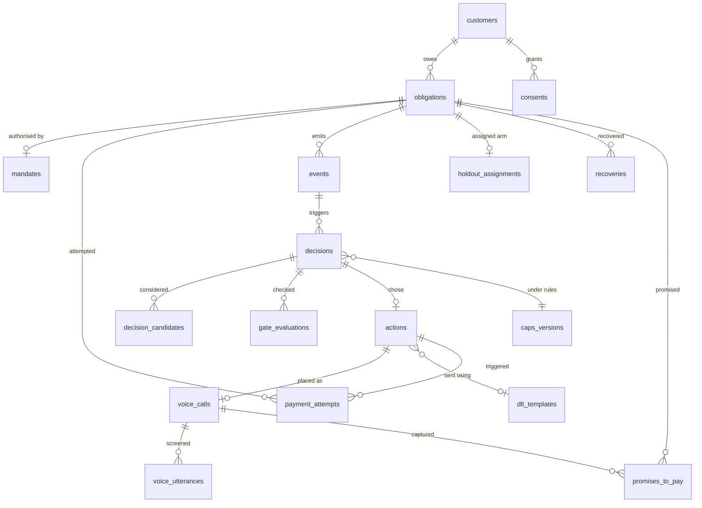

# Data model

Derived from the requirements in `RESEARCH.md`. Every table below exists to
answer something the brief asks for, or to close a gap §5/§10 identifies.

## Engine

**DECIDED (28 Aug): MySQL — team choice, installed and wired.** The schema below
is LIVE: `backend/repositories/migrations/001_full_schema.sql`, applied by
`ensure_schema()` at startup. The two MySQL footguns are neutralised in code:
every connection pins `time_zone='+00:00'` (all DATETIME values are UTC by
construction) and charset is utf8mb4 (Devanagari verbatim text). The
one-active-mandate-per-obligation invariant moves to application code — MySQL
has no partial unique index.

The original engine comparison, kept for the record:

1. **`TIMESTAMPTZ`.** The RBI 08:00–19:00 gate is borrower-local. Postgres stores
   UTC and converts explicitly (`AT TIME ZONE 'Asia/Kolkata'`). MySQL's
   `DATETIME` is timezone-naive and `TIMESTAMP` converts via the *session*
   timezone — so a connection-config change can silently alter whether an action
   was legal. That is a compliance bug living in a connection string.
2. **JSONB + partial indexes.** We query inside stored payloads, and our real
   invariants are partial: `UNIQUE (obligation_id) WHERE status='active'` for one
   active mandate per obligation. MySQL 8 needs generated columns or triggers.

MySQL 8 is workable if that is the team's fluency — you lose partial indexes and
inherit the timezone footgun. Keep the DDL portable either way.

## Non-negotiable conventions

| Rule | Why |
|---|---|
| **Money is `BIGINT` paise.** Never `FLOAT`, never `DECIMAL`. | Rupee floats accumulate error; paise integers are exact and match Razorpay's own unit. |
| **Facts are append-only.** `events`, `decisions`, `gate_evaluations`, `consents` are never `UPDATE`d. | The audit trail must be immutable. Current state is derived from the latest row. |
| **All timestamps UTC**, converted only at the edge. | `occurred_at` is UTC; the window gate evaluates in Asia/Kolkata. |
| **No hard `DELETE` on customer data.** Use `redacted_at` + `redaction_reason`, null the content, keep the row. | DPDP erasure yields where retention is required by other law — RBI's 2008 recording mandate, PMLA/KYC. §9.4. |
| **Every external reference gets a `UNIQUE` constraint.** | Webhook redelivery idempotency lives in the schema, not in application luck. |
| **Enums as `TEXT` + `CHECK`**, not native `ENUM`. | Portable across SQLite/Postgres/MySQL; adding a value is not a table rewrite. |

## Table map

### Tier 1 — Core (the demo does not work without these)

| Table | Purpose | Key columns |
|---|---|---|
| `customers` | The counterparty. | `external_ref` UQ, `phone_e164`, `preferred_language`, `timezone` (default Asia/Kolkata — the contact window is *local*), `redacted_at` |
| `obligations` | **The central object.** The thing that owes money. | `external_ref` UQ, `kind` (subscription/emi/invoice), `amount_paise`, `status`, `due_at`, `first_failed_at`, `tenure_days`, `lifetime_value_paise` |
| `mandates` | **The differentiator.** RBI e-mandate state. §10.1: no vendor surveyed models this. | `rail`, `status` (pending/active/paused/revoked/expired), `max_amount_paise` (the cap), `registered_at`, `expires_at`, `next_debit_at`, `pre_debit_notice_sent_at`, `pre_debit_notice_opt_out_at`, `processing_lock_until` |
| `payment_attempts` | Each debit attempt. Drives the attempt-budget gate. | `attempt_number`, `rail`, `decline_family`, `decline_code_raw`, `merchant_advice_code` (MAC 03/21 = hard stop), `gateway_ref` UQ, `triggered_by_decision_id` |
| `events` | Canonical `RecoveryEvent` stream. Append-only. **Built.** | `event_id` PK (idempotency), `event_type`, `decline_family`, `amount_paise`, `raw` |
| `decisions` | **The product.** One row per decision point. Append-only. **Schema built.** | `strategy` (baseline/agentic), `arm` (treatment/control), `diagnosis_family`, `diagnosis_rationale`, `caps_version`, `chosen_action_id` (NULL = deliberately did nothing) |
| `decision_candidates` | One row per action *considered*. Normalised, not JSON. | `action_type`, `expected_value_paise`, `cost_paise`, `rank`, `blocked`, `blocked_by_gate` |
| `gate_evaluations` | **The compliance audit artefact.** One row per constraint checked. | `gate_name`, `passed`, `detail`, **`rule_source`** |
| `actions` | An action actually executed. | `action_type`, `channel`, `status`, `scheduled_for`, `executed_at`, `cost_paise`, `provider_ref`, `idempotency_key` UQ |
| `holdout_assignments` | Randomised holdout — the only way to claim *incremental* recovery. §2.7. | `obligation_id` **UQ** (an obligation must never switch arms), `arm`, `stratum`, `batch_id` |
| `recoveries` | Money actually collected. | `amount_paise`, `recovered_at`, `rail`, `attributed_action_id`, `days_to_cash` |

Two columns above carry more weight than they look:

- **`gate_evaluations.rule_source`** — stores the *authority*, e.g.
  `'RBI/2022-23/108'` or `'caps.yaml:retry.upi_autopay'`. This is what turns a
  log into a justification, which is exactly the §5.6 gap ("audit trails are
  logs, not justifications"). It also surfaces UNVERIFIED caps in the audit: a
  decision citing an unverified rule can be flagged as such rather than
  presented as settled law.
- **`decisions.caps_version`** — answers *"what rules were in force when you
  decided this?"* Without it, editing `caps.yaml` silently rewrites history.

### Tier 2 — Differentiators (add with the voice / PTP slice)

| Table | Purpose | Key columns |
|---|---|---|
| `promises_to_pay` | First-class per §7. **PTP-kept-rate is the metric no vendor publishes** (§8.8). | `amount_paise`, `promised_for_date`, `verbatim` (the customer's own code-mixed words), `extraction_confidence`, **`readback_confirmed`**, `status` (open/kept/broken/partial), `kept_at` |
| `voice_calls` | Call record. RBI 2008 *mandates* recording for banks. | `duration_seconds`, `disposition`, **`ai_disclosure_given_at`**, `recording_uri`, `recording_retention_until`, `transcript_uri`, `language_detected`, `asr_model`, `tts_model`, `distress_detected`, `dispute_raised`, `handoff_to_human_at` |
| `voice_utterances` | **Per-utterance screening log — the tier-5 proof.** | `drafted_text` (what the LLM wanted to say), `spoken_text` (what was allowed, NULL if blocked), `screening_verdict`, `blocked_reason`, `latency_ms` |
| `consents` | DPDP purpose-scoped consent. Append-only; current state = latest row. | `purpose` (servicing/marketing/recording), `channel`, **`basis`** (consent / legitimate_use / legal_obligation), `granted` (false row = withdrawal), `evidence_ref`, `recorded_at` |

- **`voice_utterances` is the most differentiating table in the schema.** §10.4:
  Sarvam's own collection-agent cookbook has a *two-sentence prompt* as its
  entire guardrail, and Skit publishes per-utterance screening only on its US
  page. "Show me the bot refusing to say something" becomes a query here.
- **`consents.basis`** matters commercially: if recording ran on *consent*, a
  borrower could withdraw it and defeat the RBI recording mandate. It runs on
  legitimate-use / legal-obligation instead (§9.4). Modelling `basis` as a
  column keeps that distinction auditable rather than assumed.
- **`readback_confirmed`** — §8.6: no vendor solves `"pandrah tarikh"` → `15` at
  the API layer. Reading the parsed value back to the caller is both the
  correctness check and the compliance record.

### Tier 3 — Audit completeness (cheap; add before any real deployment)

| Table | Purpose |
|---|---|
| `dlt_templates` | TRAI/DLT-registered template IDs + category (utility/service/promotional). §9.5: **never let the agent improvise copy on a DLT channel** — templates are pre-approved artefacts, and mixing promotional content reclassifies the entire message as promotional. |
| `caps_versions` | Content-hashed snapshots of `caps.yaml`, so `decisions.caps_version` resolves to the exact rules in force. |

### Derived, not stored

Do **not** create tables for these — they are views, and duplicating them invites
drift:

| View | Definition sketch |
|---|---|
| `v_contacts_rolling_7d` | `actions WHERE channel IS NOT NULL` grouped by customer — drives the 7-in-7 and 2/day caps |
| `v_revenue_at_risk` | unresolved `obligations`, summed |
| `v_incremental_recovery` | `recoveries` joined to `holdout_assignments`, treatment minus control |
| `v_ptp_kept_rate` | `promises_to_pay`: `kept / (kept + broken)` |
| `v_blocked_actions` | `decision_candidates WHERE blocked` joined to `gate_evaluations` — the blocked-actions ledger |
| `v_constraint_violations` | actions executed whose gates did not all pass. **Should always be zero**; if it is not, that is the bug. |

## Relationships

The spine is **event → decision → {candidates, gates} → action → outcome**.
Every dashboard panel is a query over that spine:

| Panel | Query |
|---|---|
| Money strip | `v_revenue_at_risk`, `recoveries`, `v_incremental_recovery` |
| Live feed | `events` joined to latest `decisions` |
| Decision drawer | one `decisions` row + its `decision_candidates` + `gate_evaluations` |
| Blocked ledger | `v_blocked_actions` |
| Holdout panel | `v_incremental_recovery` grouped by `strategy` |

## Build order

Do not create all 17 tables now. Add each as the slice that writes to it lands:

1. **Next slice (diagnose → gate → score):** `obligations`, `mandates`,
   `decisions`, `decision_candidates`, `gate_evaluations`, `caps_versions`.
   `events` already exists.
2. **Execute slice:** `actions`, `payment_attempts`, `recoveries`, `customers`.
3. **Measurement slice:** `holdout_assignments` + the views.
4. **Voice slice:** `voice_calls`, `voice_utterances`, `promises_to_pay`.
5. **Pre-deployment:** `consents`, `dlt_templates`.

A table with no writer is scaffolding. The one exception already made is
`decisions` — its schema exists ahead of its writer, because retrofitting the
decision log after the fact is expensive and the whole dashboard is queries
over it.
